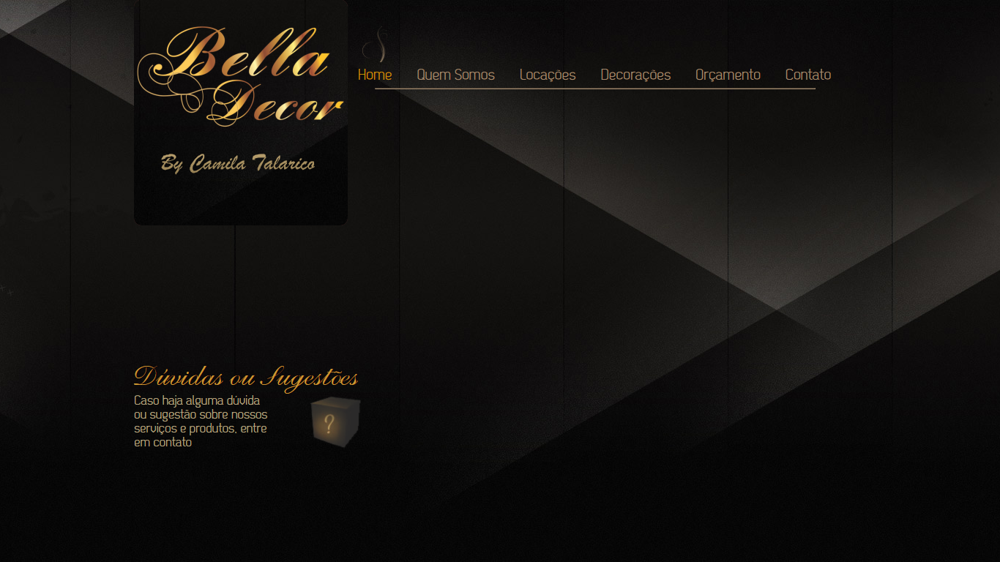
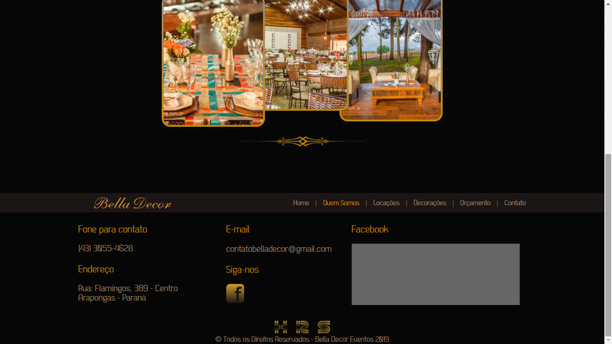
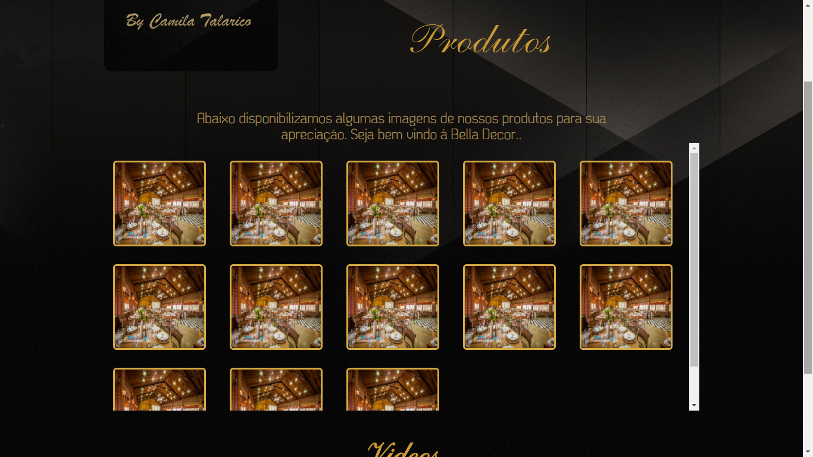
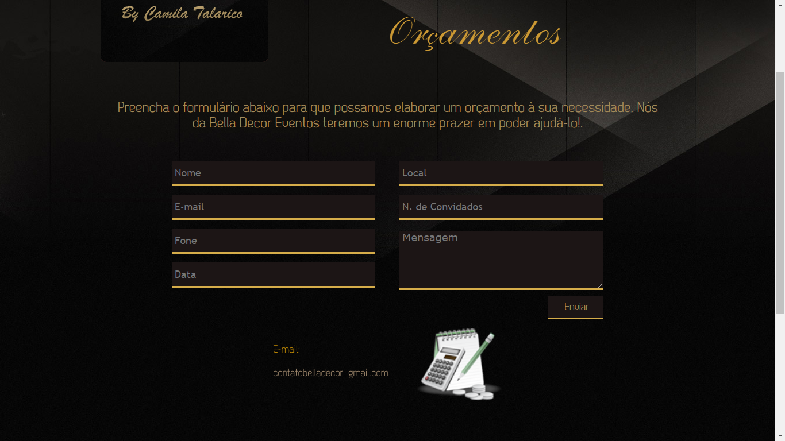
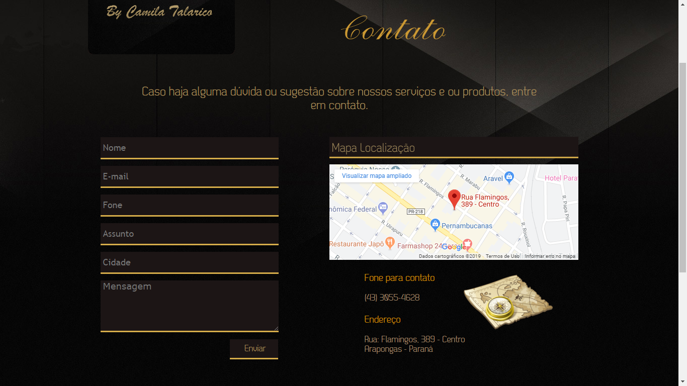

# Site-Decoracoes
Site desenvolvido em meado de 2012 dando início ao trabalho profissional

Site de Decorações com Painel administrativo programado por mim do zero desde o front-end ao back-end em PHP, onde foi de extrema importância o meu aprendizado.
De forma estrutural onde tentava sempre inovar da minha maneira, hoje em dia claro que não é uma boa prática o metodo e a maneira
como foi programado, mas na época foi muito importânte para mim testar novos conhecimentos e o mais importante, ajuando o usuário final.

# Configuração

Dentro da pasta (DADOS DO BANCO DE DADOS) contém o arquivo .sql do banco de dados (Mysql).

      
